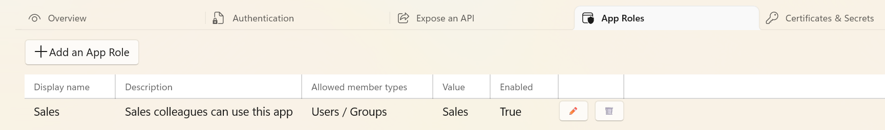

# UI
Use this UI to manage your Azure AD app registrations in case your admin/company did disable UI access to Entra ID:

> Use this switch to prevent users from misconfiguring the resources that they own from the Microsoft Entra admin center.
  This is not a security measure.
  "No" lets non-administrators browse the Microsoft Entra admin center.
  "Yes" restricts: Non-administrators from browsing the Microsoft Entra admin center. (Non-administrator who are owners of groups or applications from using the Microsoft Entra admin center to manage their owned resources.)

## Info
It provides a user-friendly interface for creating, updating, and managing app registrations, including setting up app roles and viewing the application manifest.

## Overview

## Authentication

## Expose API

## App Roles

## Certificates & Secrets

## Manifest (json)

